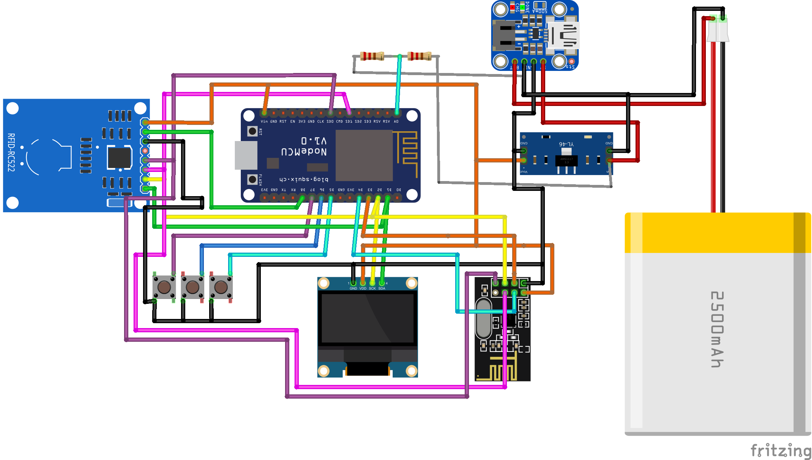

# ShadowFlipper

## Project Description

ShadowFlipper is a pen-testing device designed to test vulnerabilities in RFID, Wi-Fi, and 2.4 GHz systems. It is equipped with a range of tools and features that allow for comprehensive testing and analysis of target systems. These include:

- RFID reader and writer
- Wi-Fi and Bluetooth scanner
- 2.4 GHz signal analyzer
- Easy-to-use
- interface integrated with a 0.96 OLED screen
- 3 navigation buttons
- Serial connection

The device is designed to be portable and easy to use, allowing for on-the-go testing and analysis. It is also open source, with a community of developers contributing to its ongoing development and improvement.

## Target Audience

ShadowFlipper is intended for security professionals, pen-testers, and hobbyists who want to identify and exploit vulnerabilities in RFID, Wi-Fi, and 2.4 GHz systems. It is also suitable for educational purposes, allowing students to learn about pen-testing and security testing methodologies.

## Functional Requisites

- RFID read and write capabilities
- Wi-Fi and Bluetooth scanning capabilities
- 2.4 GHz signal analysis capabilities
- Easy-to-use interface with an OLED screen and navigation buttons
- Serial connection for data transfer
- Compatibility with relevant software and operating systems

## Non-Functional Requisites

- Security: The device should be secure and not introduce vulnerabilities to the systems it is testing. It should also be designed to protect the privacy and security of user data.
- Reliability: The device should be reliable and accurate in its testing and analysis. It should also be durable and able to withstand regular use and travel.
- Compatibility: The device should be compatible with a range of systems and software, and should be designed to work seamlessly with other tools and technologies.
- User Experience: The device should be easy to use and intuitive, with a clear and simple interface that allows users to quickly and easily access the tools and features they need.
- Performance: The device should be fast and efficient in its testing and analysis, with quick response times and minimal lag.
- Portability: The device should be lightweight and portable, with a compact design that allows for easy storage and travel.

## Use Cases

- **Penetration Testing**: Security professionals and pen-testers can use ShadowFlipper to identify and exploit vulnerabilities in RFID, Wi-Fi, and 2.4 GHz systems. This can include testing the security of access control systems, wireless networks, and other systems that rely on these technologies.
- **Education and Training**: ShadowFlipper can be used as a teaching tool for students and professionals who are learning about pen-testing and security testing methodologies. Its user-friendly interface and comprehensive feature set make it an ideal tool for training and education purposes.
- **Research and Development**: ShadowFlipper can be used by researchers and developers who are working on new technologies and systems that utilize RFID, Wi-Fi, and 2.4 GHz technologies. Its advanced features and open-source design make it a versatile tool for exploring and testing new technologies.
- **Personal Use**: Hobbyists and enthusiasts can use ShadowFlipper to test and analyze their own systems, or to learn more about the technologies and tools used in pen-testing and security testing.
- **Field Use**: ShadowFlipper's portable design and easy-to-use interface make it an ideal tool for testing and analysis in the field. It can be used by security professionals and pen-testers who need to perform on-the-go testing and analysis, or by hobbyists who want to take their testing and analysis to new locations and environments.

## Required Modules

- **NodeMCU** (ESP 8266) to control
- **NRF24** for wireless communication
- 0.96 **OLED screen** for display
- **RFID sensor** for reading and writing RFID tags
- 3 **buttons** for navigation
- 3.7V **battery** for power supply

